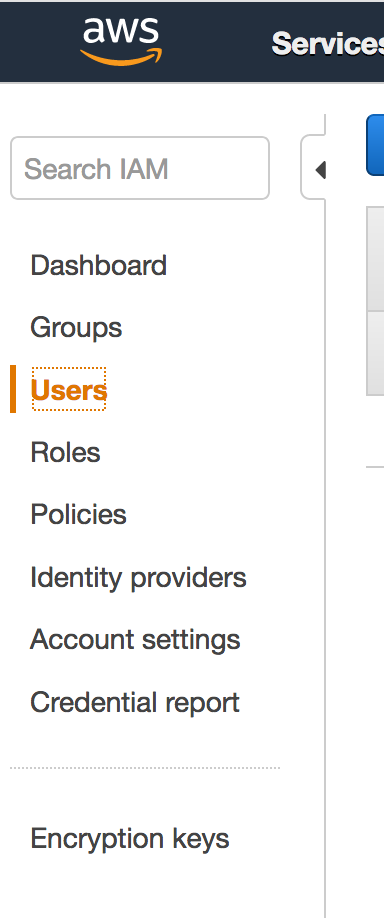
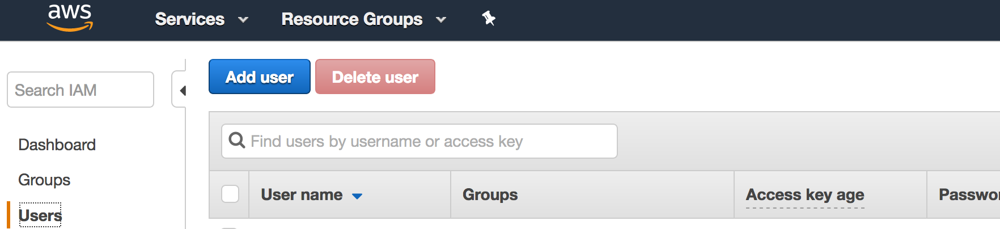
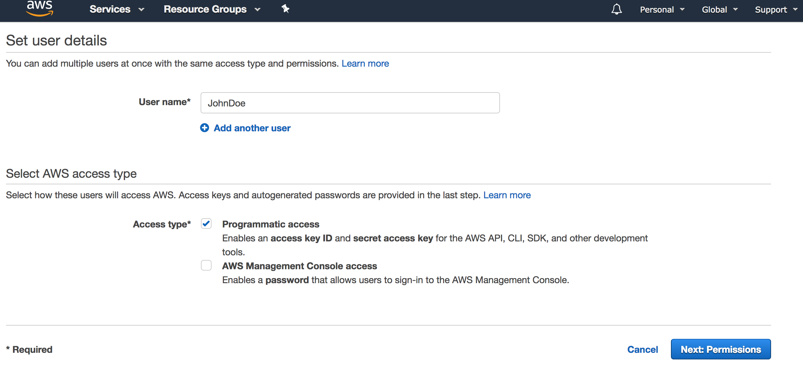
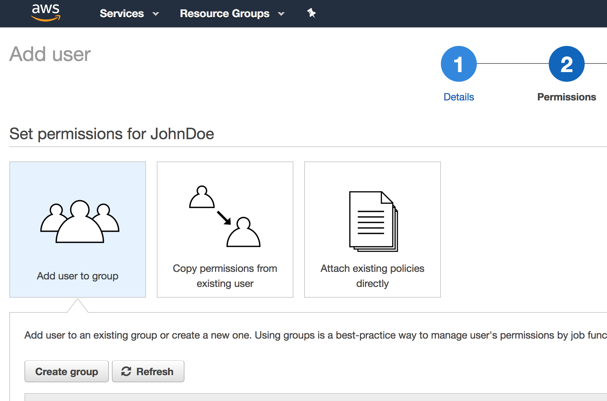
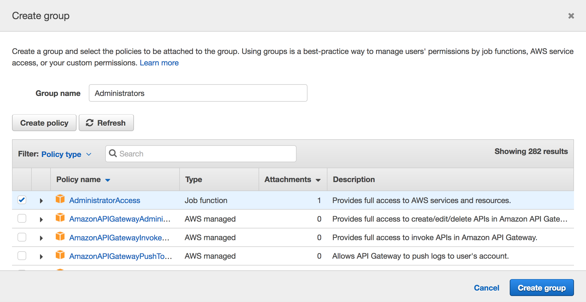
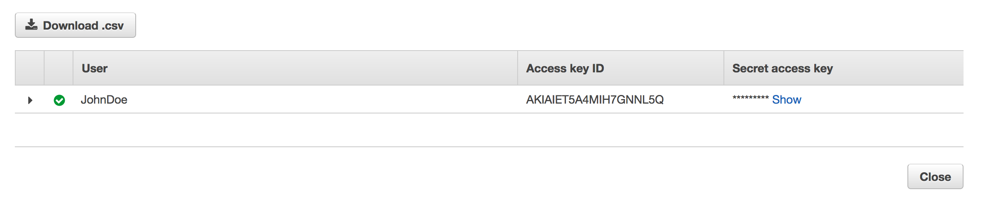
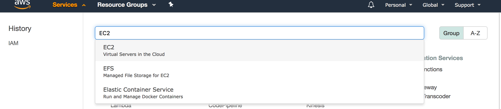
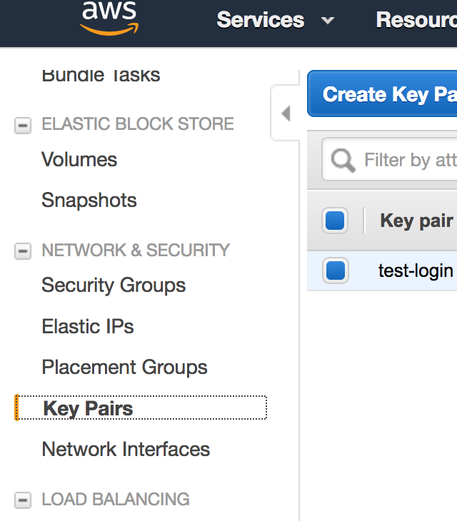
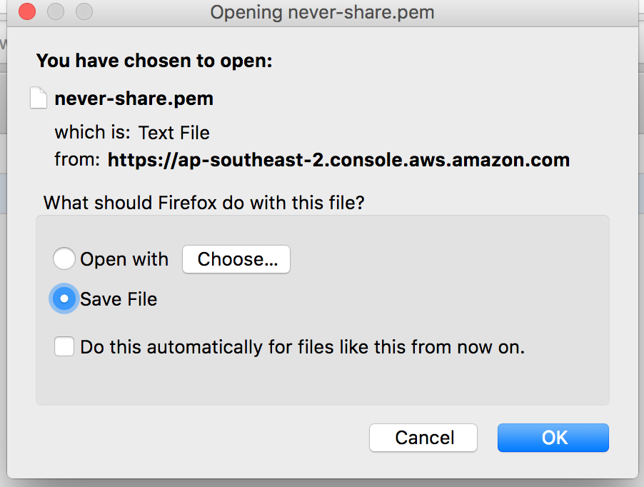

# Setting up your AWS Account

- [Create an AWS account](https://portal.aws.amazon.com/billing/signup) - Firefox will provide you with better experience :)
- [Sign in to AWS account](https://signin.aws.amazon.com/signin)
- Create a User for terraform to work with,

  **Type IAM in the services bar and click on it.**
  

  **Select Users in the left panel of IAM**

  

  **Click on Add User**
  

  **Give the User a name and enable programatic access**
  

  **Click Next and on the Next screen Click on Create Group**
  

  **Give the Group a name and allow Administrator Access**
  

- Click on Review and Create User

  **On the last page download the CSV**
  

- Create a Keypair

  **Open Services and select EC2**
  

  **Scroll down to Network Security and select Key Pairs**
  

  **Create a Keypair, give it a name and download the pem certificate file**
  

- Move the `.pem` file to `~/.ssh`, and reduce its permissions to 0600 using `chmod 0600 ~/.ssh/[pemfile]`
